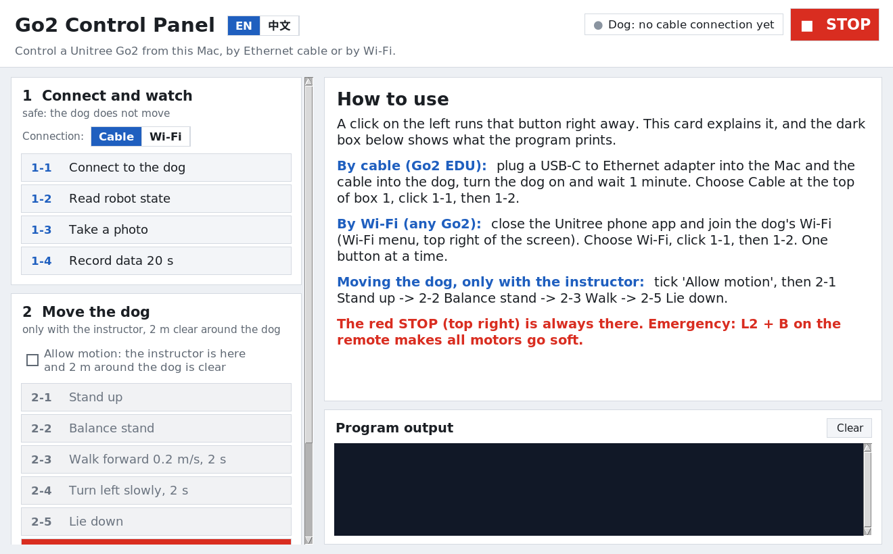

# Go2 Control Panel

Control a Unitree Go2 robot dog from your Mac with buttons, by **Ethernet cable** or by **Wi-Fi**.



Each button does one step and explains itself: connect to the dog, read its state (battery, tilt, leg angles,
foot forces), take a photo, record 20 s of camera and state data, stand up, balance, walk, turn, lie down, and
**STOP**. The panel starts in English; the **中文** switch shows the buttons, explanations and error messages in
Chinese (the programs' own output stays in English).

| Connection | How it talks to the dog | Works on | Internet on the Mac |
|---|---|---|---|
| **Cable** | the official Unitree SDK (DDS) over a USB-Ethernet cable | Go2 **EDU** | stays on (the Mac's Wi-Fi is not used for the dog) |
| **Wi-Fi** | WebRTC, the same way the Unitree phone app does it | Go2 AIR, PRO, EDU | off while on the dog's Wi-Fi (see below) |

The Go2 comes in three models: AIR, PRO and EDU. **EDU** is the research model, and only EDU can be controlled over
the cable. Not sure which one you have? Ask your instructor.

Tested on a real Go2 EDU in the lab, over both cable and Wi-Fi, from an Apple Silicon Mac (macOS 15), in
September 2026.

## How the computer talks to the dog (any computer)

The panel is a Mac app, but connecting to the dog works the same way on Windows, Linux or a Mac. This is everything
the panel does underneath.

### By cable: the official Unitree SDK over DDS (Go2 EDU)

| | |
|---|---|
| The dog's computer | `192.168.123.161` |
| Your computer | a fixed address on the same network, e.g. `192.168.123.222`, subnet mask `255.255.255.0` (prefix 24), no gateway |
| Protocol | DDS ([Cyclone DDS](https://github.com/eclipse-cyclonedds/cyclonedds-python) 0.10.2), domain `0`. The two sides find each other by UDP multicast on the cable, so no address appears in the code, only the network card. |
| Library | [unitree_sdk2_python](https://github.com/unitreerobotics/unitree_sdk2_python) (`unitree_sdk2py`), Python 3.10 |
| Robot state | topics `rt/lowstate` (12 joints, IMU, foot forces, battery) and `rt/sportmodestate` (mode, body height, velocity, position), hundreds of messages a second |
| Commands | a request on `rt/api/sport/request`, the answer on `rt/api/sport/response` (numbers below) |
| Camera | `VideoClient().GetImageSample()`: service `videohub`, API 1001, one JPEG per call |

Give your computer the fixed address on the cable's network card:

- **Windows:** Settings > Network & internet > Ethernet > IP assignment > Edit > Manual, IPv4 on:
  IP address `192.168.123.222`, subnet mask `255.255.255.0` (or prefix length `24`), gateway empty.
- **Linux:** `sudo ip addr add 192.168.123.222/24 dev eth0` (your card's name: `ip -br link`).
- **Mac:** button 1-1 in the panel does it; by hand: System Settings > Network > (the adapter) > Details > TCP/IP >
  Configure IPv4: Manually.

Then `ping 192.168.123.161` must answer. Minimal Python (with the environment from the install below):

```python
import time
from unitree_sdk2py.core.channel import ChannelFactoryInitialize, ChannelSubscriber
from unitree_sdk2py.idl.unitree_go.msg.dds_ import LowState_
from unitree_sdk2py.go2.sport.sport_client import SportClient

# domain 0 + the network card on 192.168.123.x: Mac e.g. "en7", Linux e.g. "eth0",
# Windows the adapter's name as Windows shows it, e.g. "Ethernet 2" (PowerShell: Get-NetAdapter)
ChannelFactoryInitialize(0, "en7")

latest = {}
sub = ChannelSubscriber("rt/lowstate", LowState_)
sub.Init(lambda msg: latest.update(msg=msg), 10)
time.sleep(1)
msg = latest["msg"]
print(f"battery {msg.power_v:.1f} V, front-right leg angles {[round(m.q, 2) for m in msg.motor_state[:3]]}")

sport = SportClient()
sport.SetTimeout(5.0)
sport.Init()
print("StandUp returned", sport.StandUp())   # 0 = OK. The dog stands up: only with the instructor!
```

### By Wi-Fi: WebRTC, like the phone app (any Go2)

| | |
|---|---|
| The dog's own hotspot | the dog is `192.168.12.1`; your computer gets a `192.168.12.x` address from it |
| Dog on a router (STA mode) | use the dog's address on that router instead |
| Signaling | HTTP on the dog's port `9991` (newer firmware) or `8081` (older) |
| Protocol | WebRTC: a data channel carries the same topics and command numbers as the cable; the camera comes as a video stream |
| Library | [unitree_webrtc_connect](https://github.com/legion1581/unitree_webrtc_connect) 2.2.0, Python 3.8 or newer, Windows / Linux / Mac |
| Key | firmware 1.1.15 or newer: the dog's AES-128 key (32 hex characters), see [Wi-Fi key](#wi-fi-key-firmware-1115-or-newer) |
| Robot state | topics `rt/lf/lowstate` and `rt/lf/sportmodestate` (lower-rate copies) |
| Clients | one at a time: close the Unitree phone app first |

Minimal Python:

```python
import asyncio
from unitree_webrtc_connect.webrtc_driver import UnitreeWebRTCConnection, WebRTCConnectionMethod

async def main():
    conn = UnitreeWebRTCConnection(WebRTCConnectionMethod.LocalAP)   # add aes_128_key="..." on firmware 1.1.15+
    # dog on a router: UnitreeWebRTCConnection(WebRTCConnectionMethod.LocalSTA, ip="192.168.1.23")
    await conn.connect()
    conn.datachannel.pub_sub.subscribe("rt/lf/lowstate", lambda m: print("battery", m["data"]["power_v"], "V"))
    await asyncio.sleep(2)
    answer = await conn.datachannel.pub_sub.publish_request_new("rt/api/sport/request", {"api_id": 1004})
    print("StandUp returned", answer["data"]["header"]["status"]["code"])   # 0 = OK. The dog stands up!
    await conn.disconnect()   # always hang up: the dog takes one Wi-Fi client at a time

asyncio.run(main())
```

### The commands (the same numbers on both connections)

| Command | Number (`api_id`) | Parameter | The dog answers? |
|---|---|---|---|
| Damp (all motors soft) | 1001 | none | yes |
| BalanceStand | 1002 | none | yes |
| StopMove | 1003 | none | yes |
| StandUp | 1004 | none | yes |
| StandDown (lie down) | 1005 | none | yes |
| RecoveryStand (get up after a fall) | 1006 | none | yes |
| Move | 1008 | `{"x": forward m/s, "y": left m/s, "z": turn left rad/s}` | no: re-send it about 20 times a second while walking, then StopMove |

With the SDK these are `SportClient()` methods: `Damp()`, `BalanceStand()`, `StopMove()`, `StandUp()`, `StandDown()`,
`RecoveryStand()`, `Move(vx, vy, vyaw)`. Answer code `0` means OK. On the cable, `3102` means the request could not
be sent (the dog's sport service was not found) and `3104` means no answer in time. Before moving, the scripts ask
`rt/api/motion_switcher/request` (API 1001, CheckMode): an empty mode name means the dog's own walking controller is
off and sport commands do nothing. These commands only say what to do; the dog's own controller moves its 12 motors.
Keep speeds small: the panel allows at most 0.3 m/s and 0.5 rad/s, for 3 s.

## What you need

- For the panel: a Mac (Apple Silicon or Intel). Windows and Linux: see [below](#windows-and-linux-command-line-not-tested-yet).
- **Python 3.10.** Not newer: the cable SDK's DDS library (cyclonedds 0.10.2) only has ready-made packages up to 3.10.
  Other Python versions on your Mac can stay; 3.10 installs next to them.
- For the cable: a Go2 **EDU**, a **USB-C to Ethernet adapter** and an Ethernet cable, and the password of an
  administrator of your Mac (on your own Mac: your login password).
- For Wi-Fi: any Go2, and the dog's Wi-Fi password. Newer firmware also needs a key, see [Wi-Fi key](#wi-fi-key-firmware-1115-or-newer).

## Install on a Mac (once, a few minutes, needs internet)

All commands go into **Terminal**: press Cmd+Space, type `Terminal`, press Return. Paste one command at a time and
press Return after each.

1. **Python 3.10.** Download the
   [macOS installer for Python 3.10.11](https://www.python.org/ftp/python/3.10.11/python-3.10.11-macos11.pkg)
   ([release page](https://www.python.org/downloads/release/python-31011/)) and run it. Check in Terminal:
   ```
   python3.10 --version
   ```
2. **Download this panel and set it up:**
   ```
   git clone https://github.com/harry567566/go2-control-panel.git
   cd go2-control-panel
   bash setup.sh
   ```
   If macOS says `git` needs the command line developer tools, click **Install** (not "Get Xcode"), wait until it
   finishes (it can take 10 minutes or more), then run the three lines again.
   `setup.sh` makes a Python environment in `.venv` inside this folder, with both Unitree libraries. Nothing outside
   the folder is changed. The folder is now in your home folder; `open .` shows it in Finder.
3. **Start the panel:** double-click `start.command` in Finder, or in Terminal:
   ```
   .venv/bin/python control_panel.py
   ```
   Optional: `bash tools/make_app.sh` puts a **Go2 Control Panel** app with a Go2 icon on your Desktop.

**Every new Terminal window starts in your home folder:** type `cd go2-control-panel` first, then the command.
If you move or rename the folder, run `bash setup.sh` again (and `bash tools/make_app.sh` again if you use the app).

Using conda instead of the python.org installer: `conda create -y -n go2 python=3.10`, then
`PYTHON="$(conda info --base)/envs/go2/bin/python" bash setup.sh`.

Downloaded the ZIP instead of using git? The folder is then called `go2-control-panel-main`, so use
`cd go2-control-panel-main`, and start the panel with `bash start.command` (macOS may block double-clicking files
that came from a download).

## In the panel: connect by cable (Go2 EDU)

1. Plug the USB-C to Ethernet adapter into the Mac, and the cable into the dog's Ethernet port (ask your instructor
   where it is on your dog). Turn the dog on and wait about 1 minute.
2. In the panel choose **Cable** at the top of box 1 (*Connect and watch*).
3. Click **1-1 Connect to the dog**. macOS asks once for the password of an **administrator** of this Mac: the panel
   gives the adapter the address 192.168.123.222, on the dog's network (the dog is 192.168.123.161). Your Wi-Fi is
   not touched. If you are not an administrator of the Mac, use Wi-Fi instead.
   You want `ROBOT REACHABLE`, and the top right turns green: **Dog connected (en7)**. (en7 is the adapter's name on
   this Mac; yours may be different.)
4. Click **1-2 Read robot state**. If a new line of numbers appears every half second, everything works.

The adapter keeps the address 192.168.123.222 afterwards. To use it on a normal wired network again: System Settings >
Network > (the adapter) > Details > TCP/IP > Configure IPv4: Using DHCP.

## In the panel: connect by Wi-Fi (any Go2)

1. **Close the Unitree app on your phone.** The dog accepts only one Wi-Fi client at a time.
2. Click the Wi-Fi icon at the top right of the Mac screen and join the dog's Wi-Fi (its name usually starts
   with Go2; ask your instructor for the password).
3. In the panel choose **Wi-Fi** at the top of box 1, click **1-1**, then **1-2**.
4. Click **one button at a time** and wait for `done` (or `failed`): each Wi-Fi command first connects, which takes a
   few seconds.

**Internet while on the dog's Wi-Fi.** The panel does not need internet. If you want it anyway, connect your phone
to the Mac with a USB cable and turn on its hotspot; the Mac then uses the phone for internet and Wi-Fi for the dog.

**Dog on a router instead of its own hotspot.** If the dog has been put on a normal Wi-Fi router (Unitree app,
STA mode) and the Mac joins the same router, save the dog's address on that router, for example
`echo 192.168.1.23 > robot/.go2_wifi_ip`. The panel then uses it. To go back to the dog's hotspot:
`rm robot/.go2_wifi_ip`. Campus Wi-Fi usually blocks devices from talking to each other, so this needs a small router
or a phone hotspot.

### Wi-Fi key (firmware 1.1.15 or newer)

Newer Go2 firmware encrypts the Wi-Fi connection with a key that belongs to that dog. Get it once, **with internet**,
using the Unitree account the dog is registered to (ask your instructor). First list the dogs on the account, with
their serial numbers:

```
.venv/bin/unitree-fetch-aes-key --email you@example.com --device-type Go2
```

Then save the key of your dog (put in your own email and your dog's serial number):

```
.venv/bin/unitree-fetch-aes-key --email you@example.com --device-type Go2 --sn B42D2000XXXXXXXX -q > robot/.go2_aes_key
```

Both ask for the account password; nothing appears while you type it, press Return at the end. Keep
`--device-type Go2` (the default is the G1 humanoid); add `--region cn` for an account made in the Chinese Unitree app.
Check: `cat robot/.go2_aes_key` shows 32 letters and digits; if not, run `rm robot/.go2_aes_key` and try again.
The key stays in `robot/.go2_aes_key` on your Mac and is never uploaded. Older firmware does not need it: **1-1**
tells you whether a key was found.

## Windows and Linux (command line, not tested yet)

The panel's window and its `.sh` helpers are Mac-only, but the scripts in `robot/` are plain Python and use the same
connection as above. First give the computer its address (cable) or join the dog's Wi-Fi, as described in
[How the computer talks to the dog](#how-the-computer-talks-to-the-dog-any-computer).

**Windows** (Python 3.10: the "Windows installer (64-bit)" on the
[3.10.11 page](https://www.python.org/downloads/release/python-31011/)). In PowerShell, inside the downloaded folder:

```
py -3.10 -m venv .venv
.venv\Scripts\pip install cyclonedds==0.10.2 numpy
.venv\Scripts\pip install --no-deps https://github.com/unitreerobotics/unitree_sdk2_python/archive/814556d15970dd2ecf1c9984e845ca02ab07e206.zip
.venv\Scripts\pip install "aiortc>=1.9.0" pycryptodome requests curl_cffi wasmtime lz4 packaging sounddevice pydub pillow
.venv\Scripts\pip install --no-deps unitree_webrtc_connect==2.2.0

.venv\Scripts\python robot\cable_state.py "Ethernet 2" 10     # cable: the adapter's name from Get-NetAdapter
.venv\Scripts\python robot\wifi_state.py ap 10                # Wi-Fi: on the dog's hotspot
.venv\Scripts\python robot\wifi_sport.py ap standup --yes     # moves the dog
```

If the cable SDK fails to start on Windows, create the folder `C:\tmp`: the SDK writes a log file to `/tmp/cdds.LOG`.

**Linux** (Ubuntu 22.04 comes with Python 3.10): `sudo apt install python3.10-venv python3-tk`, then `bash setup.sh`,
then the same commands as on the Mac with your card's name from `ip -br link`, for example
`.venv/bin/python robot/cable_state.py eth0 10`.

## The buttons

| Button | What happens | Moves the dog? |
|---|---|---|
| **1-1 Connect to the dog** | Cable: sets up the adapter and pings the dog. Wi-Fi: checks the Mac is on the dog's Wi-Fi and the dog answers. | no |
| **1-2 Read robot state** | 10 s of battery, tilt, body height, sport mode, leg angles, foot forces, messages per second. | no |
| **1-3 Take a photo** | One front-camera image, opened on the Mac and saved in `data/photos/`. | no |
| **1-4 Record data 20 s** | Camera frames (5 per second) and robot state, saved in `data/cable_run_<time>/` or `data/wifi_run_<time>/`. | no |
| **2-1 Stand up** | StandUp: the dog stands and holds still. | **yes** |
| **2-2 Balance stand** | BalanceStand: ready to walk. Do it before walking. | **yes** |
| **2-3 Walk forward** | 0.3 m/s for 3 s, then StopMove. Prints how far the dog measured it moved (up to about 0.9 m). | **yes** |
| **2-4 Turn left** | 0.5 rad/s for 3 s, then StopMove. Prints how many degrees the dog measured (up to about 85). | **yes** |
| **2-5 Lie down** | StandDown. The safe way to finish. | **yes** |
| **■ STOP** (top right, and in box 2) | Ends any motion command still running, then StopMove. Always allowed, no dialog. | stops it |
| **Damp** | All motors go soft. **A standing dog drops**: only after Lie down. | **yes** |
| **Close programs opened by this panel** | Ends scripts the panel started. It does not stop the dog: use STOP for that. | no |

The **2-x** buttons and **Damp** stay grey until you tick **Allow motion**, and each one asks for confirmation (the
default answer is No). Before walking or turning, the panel reads the dog's mode: if it is standing but not in
balance stand (for example right after 2-1), it sends BalanceStand first, because Move does little otherwise; if the
dog is lying down, it refuses. Everything the dark box shows is also saved in `data/logs/panel_<date>.log`. A recording has these columns in `state.csv`: time, 12 joint angles, 12 joint speeds,
4 foot forces, roll, pitch, yaw, 3 gyroscope values, battery voltage, body velocity (3) and body position (3), plus
one JPEG per frame listed in `frames.csv`.

## Safety

- Only move the dog with your instructor there, and 2 m clear around it.
- Someone holds the **remote**. Emergency: **L2 + B** makes all motors go soft at once, so the dog sinks to the
  ground. On Wi-Fi it acts faster than the panel's STOP.
- First session order: **2-1 Stand up -> 2-2 Balance stand -> 2-3 Walk -> 2-5 Lie down**.
- Finish with **STOP -> Lie down -> wait 3 s -> Damp**. Never Damp a standing dog.
- Speed and time are capped in the scripts: at most 0.3 m/s forward, 0.2 m/s sideways, 0.5 rad/s turning, 3 s.
- The panel never sends flips, jumps or low-level motor commands.

## When something goes wrong

| Message | What to do |
|---|---|
| `No wired port with a cable found on the Mac` | Plug the adapter into the Mac and the cable into the dog, turn the dog on, click 1-1 again. |
| `Not changed (password dialog cancelled?)` | 1-1 on the cable needs an administrator password. If you do not have one, use Wi-Fi. |
| `No reply` / `Cannot reach the dog` (cable) | Wait 1 minute after turning the dog on, check the cable, turn off any VPN. |
| `The Mac is NOT on the dog's Wi-Fi yet` | Join the dog's Wi-Fi from the Wi-Fi menu at the top right of the screen, then 1-1. |
| `The dog already has a Wi-Fi client` | Close the Unitree phone app (or any other program talking to the dog). |
| `needs the dog's AES key` / `rejected the AES key` / `does not look like a key` | See [Wi-Fi key](#wi-fi-key-firmware-1115-or-newer). |
| `Wait for the running Wi-Fi command to finish` | The dog takes one Wi-Fi command at a time: wait for `done`. |
| `sport mode is RELEASED` | The dog is in low-level mode. Ask your instructor, or restart the dog. |
| The dog only moves a little when walking or turning | Do 2-2 Balance stand first (2-3 and 2-4 now do it for you). The dog speeds up gradually, so it covers less than speed x time; the output line `measured by the dog: moved ... m, turned ... degrees` shows how much it really moved. |
| `the dog is lying down ... Nothing sent` | Click 2-1 Stand up and 2-2 Balance stand, then walk. |
| Return code `3102` (cable) | The dog's sport service was not found: wrong network card, dog still starting, or not an EDU. |
| `no such file or directory` in Terminal | You are not in the panel's folder: `cd go2-control-panel` first. |
| `Python 3.10 is needed`, or the window does not open | Install Python 3.10 (above) and run `bash setup.sh` again. |
| `bad interpreter` | The folder was moved: run `bash setup.sh` again. |
| macOS asks to allow the local network or a folder | Click **Allow**; the panel needs them. If you clicked Don't Allow: System Settings > Privacy & Security > Local Network (or Files and Folders), and turn on Terminal or Go2 Control Panel. |

The desktop app writes what the panel prints to `~/Library/Logs/Go2ControlPanel.log`.

## How it works

Every button runs one small script in `robot/`: `cable_*.py` for the cable, `wifi_*.py` for Wi-Fi. The panel checks
the connection first, runs the script, and shows what it prints. You can run them yourself in Terminal, inside the
panel's folder:

```
bash robot/cable_check.sh                                   # 1-1 on the cable
.venv/bin/python robot/cable_state.py en7 10                # en7 = the adapter, printed by cable_check.sh
.venv/bin/python robot/cable_sport.py en7 standup           # asks Enter; --dry-run only prints
.venv/bin/python robot/cable_record.py en7 --secs 20 --fps 5 --out data/my_run

bash robot/wifi_check.sh                                    # 1-1 on Wi-Fi
.venv/bin/python robot/wifi_state.py ap 10                  # ap = the dog's own hotspot, or the dog's IP
.venv/bin/python robot/wifi_sport.py ap move 0.2 0 0 2
```

- The addresses, topics and command numbers are in
  [How the computer talks to the dog](#how-the-computer-talks-to-the-dog-any-computer). Only high-level commands are
  sent; the dog's own controller decides how to move its 12 motors.
- A walk first checks the dog's sport mode (`rt/sportmodestate`: 1 balance stand and 3 walking can walk; 0, 2, 6
  and 8 are standing, so BalanceStand is sent first; 5, 7 and 10 are lying, soft or sitting, so it refuses). It then
  re-sends Move 20 times a second and always ends with StopMove, and prints the distance and turn from the dog's own
  position estimate. STOP, the panel's time limits and closing the window all end a running walk the same way, and a
  command that has not gone out yet is not sent after STOP.

The panel has been tested on macOS only; for Windows and Linux see
[above](#windows-and-linux-command-line-not-tested-yet).

## Credits

- [unitree_sdk2_python](https://github.com/unitreerobotics/unitree_sdk2_python) by Unitree (BSD-3-Clause), with
  [Cyclone DDS](https://github.com/eclipse-cyclonedds/cyclonedds-python) (Eclipse Public License 2.0 / Eclipse
  Distribution License 1.0).
- [unitree_webrtc_connect](https://github.com/legion1581/unitree_webrtc_connect) by legion1581 (MIT), built on
  [aiortc](https://github.com/aiortc/aiortc) (BSD-3-Clause).
- The icon is a MuJoCo render of Unitree's Go2 model from [unitree_mujoco](https://github.com/unitreerobotics/unitree_mujoco)
  (BSD-3-Clause).

Made by Harry He for ENGR 6010, Fall 2026. MIT License, see [LICENSE](LICENSE).
